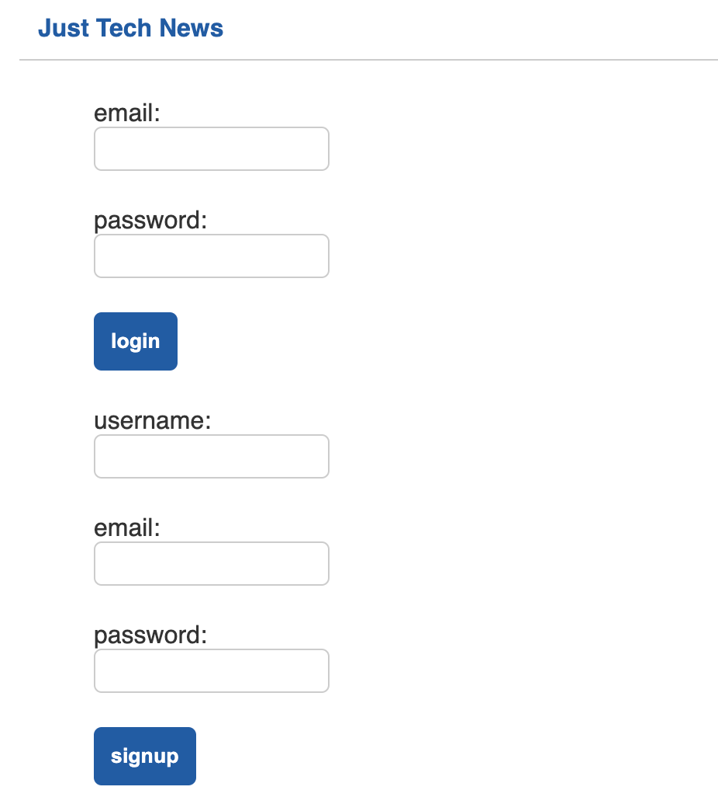
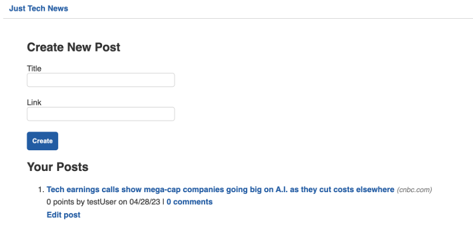
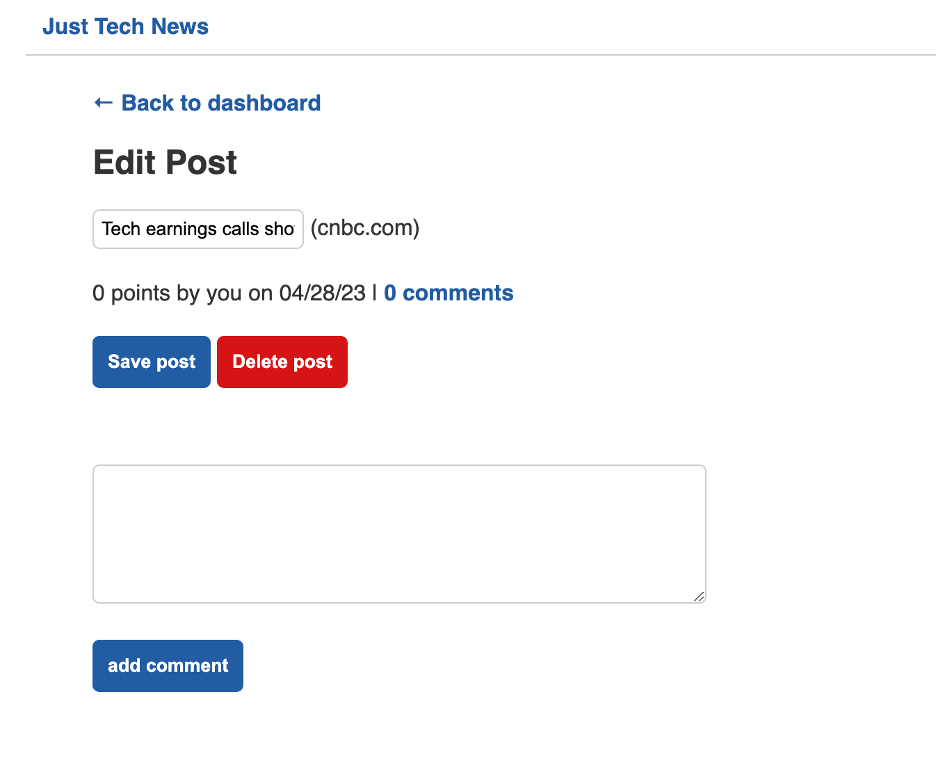
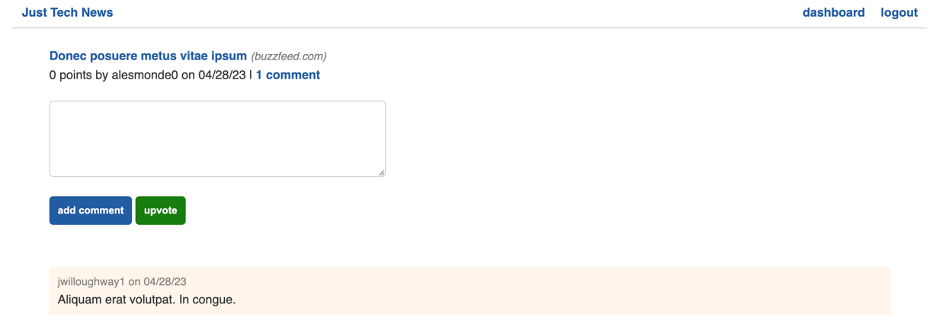

# Just Tech News

## Technology Used 

| Technology Used         | Resource URL           | 
| ------------- |:-------------:| 
| Python    | [https://www.python.org/](https://www.python.org/) | 
| Flask    | [https://flask.palletsprojects.com/en/2.3.x/](https://flask.palletsprojects.com/en/2.3.x/)      |   
| Jinja | [https://palletsprojects.com/p/jinja/](https://palletsprojects.com/p/jinja/)     |    
| Bcrypt | [https://pypi.org/project/bcrypt/](https://pypi.org/project/bcrypt/) |
| MySQL | [https://www.mysql.com/](https://www.mysql.com/) |
| SQLAlchemy  | [https://www.sqlalchemy.org/](https://www.sqlalchemy.org/) |
| Gunicorn | [https://gunicorn.org/](https://gunicorn.org/) |
| python-dotenv | [https://pypi.org/project/python-dotenv/](https://pypi.org/project/python-dotenv/) |
| Heroku | [https://www.heroku.com/](https://www.heroku.com/) |

<br/>

## Description 

[Visit the Deployed Site](https://just-tech-news-rmoscoe.herokuapp.com/)

Just Tech News allows users to post links to news stories related to technology, comment on each others' posts, and upvote (like) posts. For this project, I refactored the back end of an existing application to use Python instead of Node.js, which also required a few small changes to the front end. Specifically, I created MySQL database models and create, read, update, and delete (CRUD) routes. I also created helper functions and updated Jinja templates to connect to the new routes and use the helper functions to properly format data. In addition, I created a Flask server for the development environment and a Green Unicorn (gunicorn) server for production.

<br/>


<br/>

## Code Refactor Example

Here is an example of an API route for creating a post, refactored with Python and Flask.


```python
@bp.route('/posts', methods=['POST'])
@login_required
def create():
  data = request.get_json()
  db = get_db()

  try:
    # create a new post
    newPost = Post(
      title = data['title'],
      post_url = data['post_url'],
      user_id = session.get('user_id')
    )

    db.add(newPost)
    db.commit()
  except:
    print(sys.exc_info()[0])

    db.rollback()
    return jsonify(message = 'Post failed'), 500

  return jsonify(id = newPost.id)
```

<br/>

The following examlple shows the post-info partial updated for Jinja. Helper functions called within the template transform the data passed to the template before rendering.

```jinja
<article class="post">
  <div class="title">
    <a href="{{post.post_url}}" target="_blank">{{post.title}}</a>
    <span>({{post.post_url|format_url}})</span>
  </div>
  <div class="meta">
    {{post.vote_count}} {{post.vote_count|format_plural('point')}} by {{post.user.username}} on {{post.created_at|format_date}}
    |
    <a href="/post/{{post.id}}">{{post.comments|length}} {{post.comments|length|format_plural('comment')}}</a>
  </div>
</article>
```

<br/>

## Usage 

The homepage (see above) shows existing posts, but users must log in before creating or editing a post, commenting, or upvoting. Clicking the ***login*** link at the top of the screen navigates to the Login screen, which offers login and signup forms.



You may sign up or use the following credentials as a visitor:
* **Email**: `test@technews.com`
* **Password**: `Password123`

Logging in takes a user to the Dashboard. Users can view their existing posts and create a new post on the dashboard.



Clicking ***edit post*** allows the user to update the title, add a comment, or delete the post.



By clicking the number of existing comments on a post, a user can view and add comments or upvote the post.



<br/>

## Learning Points 

This project provided some review of Python, but primarily I learned to use the following technologies in order to create a web application in a Python ecosystem:
* Flask for building a server
* Green Unicorn (gunicorn) for building a production server
* Jinja as a template engine
* PyMySQL for connecting to a MySQL database
* SQLAlchemy as an Object Relational Mapper (ORM)

<br/>

## Author Info

### Ryan Moscoe 

* [Portfolio](https://rmoscoe.github.io/my-portfolio/)
* [LinkedIn](https://www.linkedin.com/in/ryan-moscoe-8652973/)
* [Github](https://github.com/rmoscoe)

<br/>

## Credits

Starter code provided by Trilogy Education Services, LLC, a 2U, Inc. brand, on behalf of the University of California, Berkeley Coding Boot Camp.

<br/>

## License

See repository for license information.